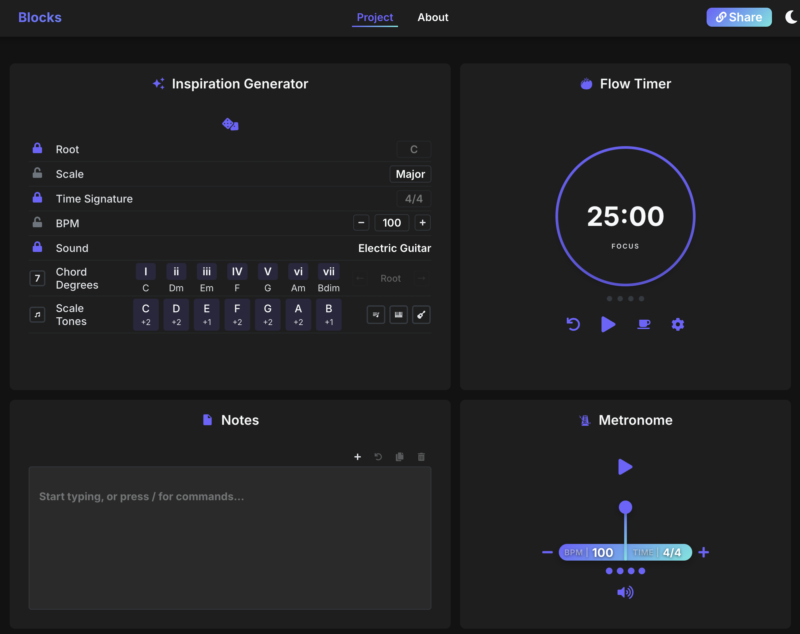
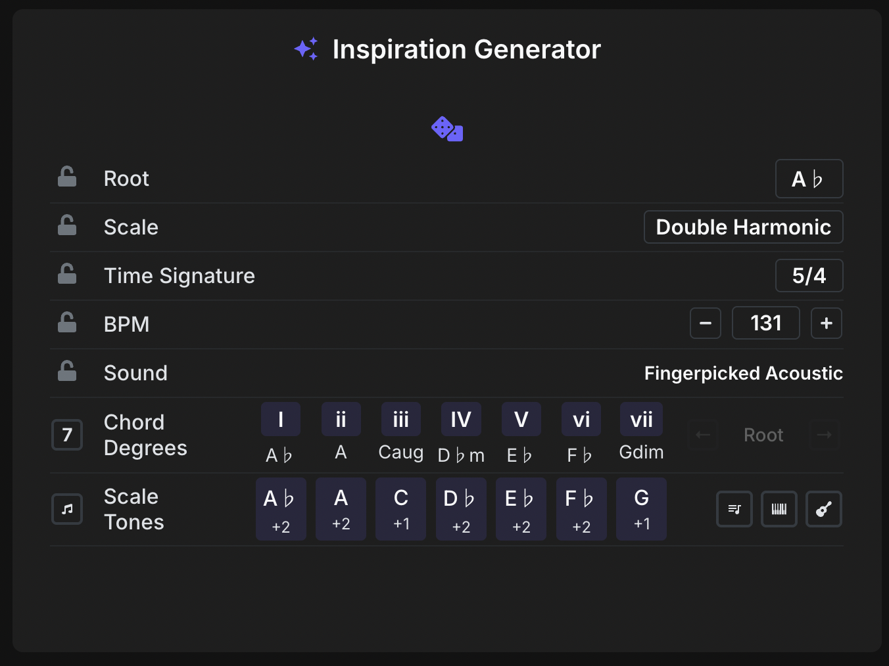
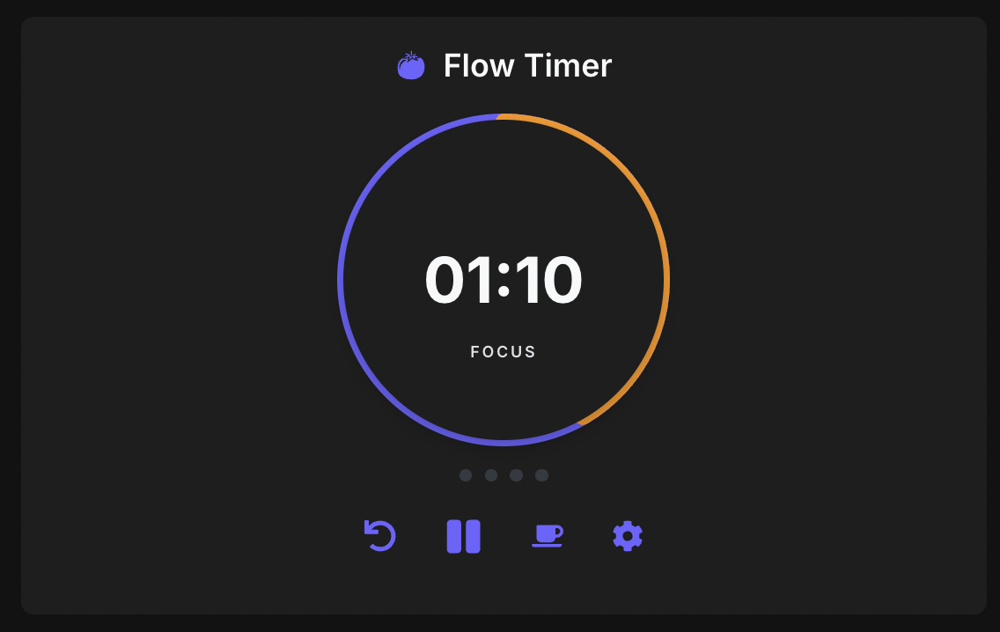
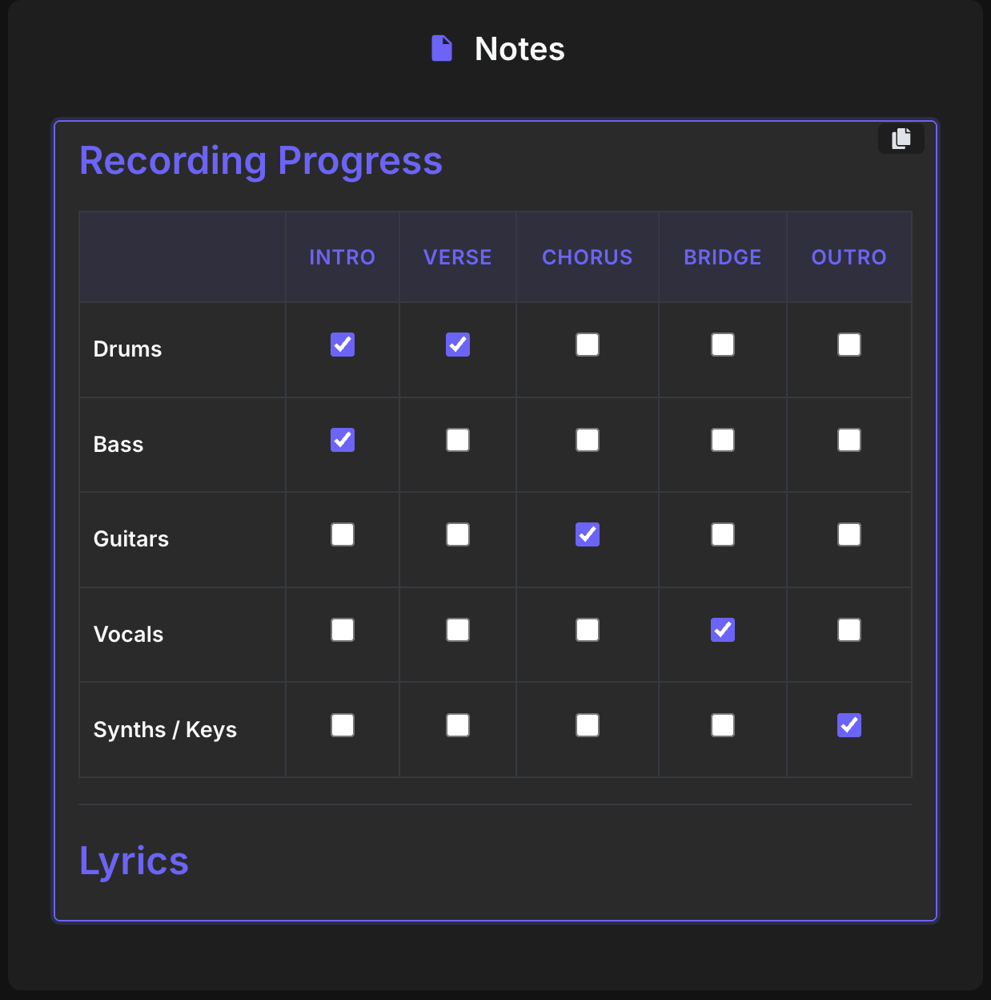
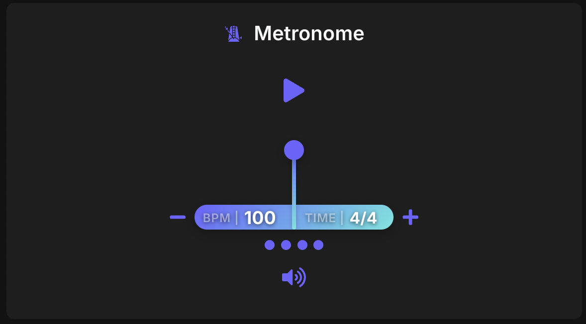
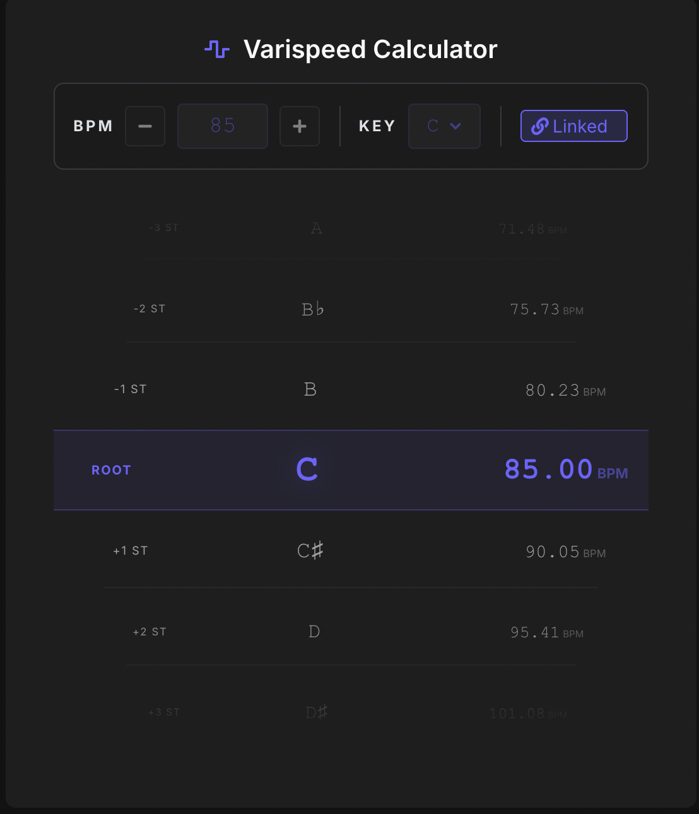
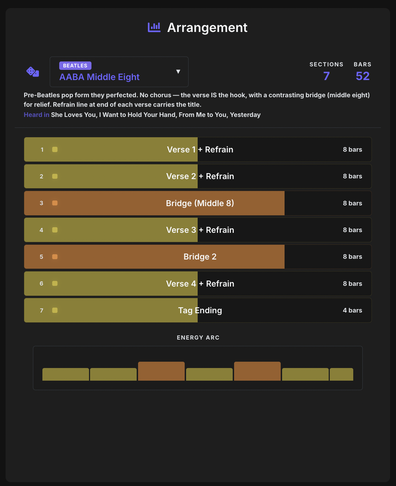

# Blocks — Tools for Creative Flow

A modular set of tools to help musicians stay creative and focused. Randomize musical ideas, visualize scales and chords on piano and guitar, keep time, plan arrangements, and capture inspiration — all in one place.

## Live Version

Try the [live version](https://fxcircus.github.io/music_blocks) on GitHub Pages, or follow the [Local Installation](#local-installation) instructions.



## Blocks

The workspace is made up of modular blocks that you can add, remove, and rearrange by dragging. Each block focuses on a specific part of the creative workflow.

---

### ✨ Inspiration Generator



The core composition tool. Roll the dice to randomize musical parameters and discover new ideas.

- **🎲 Dice Roll** — Randomly generate a root note, scale, BPM, and sound from 115 instrument presets
- **🔒 Lock Parameters** — Lock any parameter (root, scale, BPM, sound) to keep it while re-rolling the rest
- **🎵 Chord Degrees** — Click Roman numerals (I–vii) to highlight the chord tones from the current scale. Chord qualities (major, minor, diminished, augmented) are calculated automatically
- **7 Seventh Chords** — Toggle seventh chord mode to extend triads into four-note chords
- **↔ Inversions** — Cycle through root position, 1st, 2nd, and 3rd inversions for the selected chord
- **🔊 Playback** — Press the play button to hear the current scale or selected chord
- **📏 Scale Tones with Intervals** — Each scale degree shows the semitone distance to the next note
- **Circle of Fifths** — Switch the root note selector to a Circle of Fifths view for harmonic navigation

#### 🎹 Piano Visualizer

Toggle from the Scale Tones row to show an interactive 2-octave piano keyboard.

- Highlighted keys show scale notes (purple), root notes (blue), and chord tones
- Click or tap any highlighted key to hear the note played
- Pressed keys turn red with a glow effect
- Notes play at the correct octave via Web Audio API

#### 🎸 Guitar Visualizer

Toggle from the Scale Tones row to show an interactive fretboard using the **CAGED system**.

- **CAGED Position Navigation** — 5 overlapping positions (E, D, C, A, G shapes) computed dynamically from the root note. Use ‹ › arrow buttons to scroll through positions
- **12-Fret Range** — Full fretboard coverage (frets 0–12) shown through a 5-fret sliding viewport
- **Position Indicator** — Dots and shape name label below the fretboard show your current position
- **Fret Inlay Dots** — Standard guitar neck markers at frets 3, 5, 7, 9 (single dot) and 12 (double dot)
- **Clickable Notes** — Click any highlighted dot or open string to hear the note at the correct octave
- **Open Strings** — Hollow circles at fret 0 with a nut marker when the open position is in view
- **"R" Labels** — Root notes are marked with "R" for quick identification

15 scales are supported: Major, Minor, Dorian, Phrygian, Lydian, Mixolydian, Locrian, Harmonic Minor, Melodic Minor, Hungarian Minor, Double Harmonic, Phrygian Dominant, Pentatonic Major, Pentatonic Minor, and Blues.

#### 🎶 Chord Progressions

Toggle from the Scale Tones row to open the chord progressions panel. Browse and play common progressions that automatically adapt to whatever root and scale you've selected.

- **70 Named Progressions** across 8 categories: Utility, Pop, Rock, Jazz, Blues, Emotional, EDM, and Classical
- **Utility Progressions** — Educational tools including All Scale Chords, Cadence Sampler, Two-Chord Vamps, and Circle of Fifths Walk
- **Dropdown Browser** — Browse all progressions organized by genre, with example songs listed for each (e.g., "Anthem — Don't Stop Believin', Let It Be, No Woman No Cry")
- **🎲 Randomize** — Dice button picks a random progression from any category
- **▶ Playback** — Play the full progression with chords sounding simultaneously. Piano and guitar visualizations highlight each chord in real time as it plays
- **Clickable Chord Pills** — Click any chord degree in the progression to hear it and see it highlighted on piano/guitar
- **⬇ MIDI Export** — Download any progression as a `.mid` file. The filename includes the key, scale, and progression name (e.g., `A Minor - Anthem - I V vi IV.mid`). Drag the file directly into Ableton or any DAW — each chord is one bar and the clip follows your project tempo

---

### 🍅 Flow Timer



A feature-rich Pomodoro timer designed to support deep work sessions with intelligent break management.

- **Three Timer Modes** — 25-minute focus sessions, 5-minute breaks, and 15-minute long breaks (all customizable)
- **Automatic Session Cycling** — Cycles through 4 work-break sequences before triggering a longer break
- **Session Progress Tracking** — 4 visual dots show progress through the work-break cycle
- **Dynamic Progress Ring** — Animated circular display that depletes with color changes: green → orange → red
- **Distinct Audio Cues** — Three different sounds for work completion, break completion, and full cycle completion (mutable)
- **Persistent Settings** — Customize work, break, and long-break durations; all settings saved to browser
- **Click-to-Play** — Click the timer display itself to start/pause

---

### 📄 Notes



A Notion-like WYSIWYG editor for capturing ideas on the fly, powered by TipTap.

- **Slash Commands** — Type `/` to open a command menu with templates and formatting blocks
- **7 Pre-built Templates:**
  - 🎤 **Lyrics** — Verse / Chorus / Bridge structure
  - 🎬 **Recording Progress** — Table-based tracker with checkboxes per instrument and section
  - 🎹 **Chord Progression** — Chord charts per section with key reference
  - 🎛 **Pedal Settings** — Signal chain with settings per pedal
  - 🎚 **Mix Notes** — Track-by-track EQ, compression, and effects
  - 🏗 **Song Structure** — Sections with bar counts and energy levels
  - 🎯 **Session Goals** — Checklist for session workflow
- **Rich Formatting** — Headings, bullet lists, numbered lists, task lists, blockquotes, code blocks, tables, and dividers
- **📋 Rich Clipboard Export** — Copy as formatted HTML for pasting into Notion and other rich editors
- **💾 Auto-Save** — Content is automatically saved to the browser as you type

---

### 🎵 Metronome



Audio-visual metronome that syncs with the Inspiration Generator's BPM.

- **Animated Pendulum** — Swinging visual synchronized to the tempo
- **Beat Indicators** — 4 dots showing the current beat in 4/4 time
- **BPM Controls** — Adjust tempo (40–300 BPM) with +/- buttons
- **🔇 Mute Toggle** — Silence the click while keeping the visual animation
- **Accent on Beat 1** — Higher pitch click on downbeats

---

### 〰️ Varispeed



Calculate pitch and tempo changes for varispeed recording effects.

- **BPM and Key Input** — Set a base tempo and key
- **Cryptex Drum-Roller** — Scrollable interface showing 12 semitones up and down (full octave each direction) with note names and target BPMs
- **Color-Coded Landmarks** — Root note (purple) and octave boundaries (red) are always visible for quick orientation
- **Scroll, Drag & Tap** — Navigate with mouse wheel, click-drag, or tap the edges
- **🔗 Link to Generator** — Sync BPM and key with the Inspiration Generator
- Includes a tips modal with the "Strawberry Fields Forever" example and an Ableton Live Re-Pitch warp mode workflow

---

### 📊 Arrangement



Song structure templates to help plan arrangements and energy flow.

- **25 Templates** across 6 categories:
  - **General** — Slow Burn, Two Peaks, Storyteller, Hook First, Loop Rider, Call & Response, The Minimalist, The Epic, Peak & Dissolve, The Fake Out
  - **Beatles** — AABA Middle Eight, Compact & Dense, Through-Composed
  - **Pink Floyd** — Textural Expansion, Sound → Song → Sound, The Slow Boil
  - **Neil Young** — The Long Jam, Acoustic → Electric, One-Take Rawness
  - **King Crimson** — Ballad to Chaos, Interlocking Machine, Multi-Part Suite
  - **Brian Eno** — Generative Layers, Oblique Strategy, Treated Studio
- **🎲 Shuffle** — Random template button for quick inspiration
- **Energy Arc Chart** — Visual graph showing the emotional intensity across the arrangement
- **Scene Breakdown** — Each section listed with name, bar count, and energy level
- **Quick Stats** — Total sections and bars at a glance

---

## Workspace Features

- **Drag & Drop** — Rearrange blocks by dragging them into any order
- **➕ Add / Remove Blocks** — Use the floating + button to add blocks; remove any block with the × button
- **🔗 Share Your Work** — Copy a compressed URL with your full project state — settings, notes, block layout, everything
- **🌙 Dark / Light Mode** — Toggle from the navigation bar
- **❓ Contextual Help** — Hover over any block to reveal a help button with tips and instructions
- **💾 Auto-Save** — All block states persist in the browser automatically

## Technologies

- **⚛️ React + TypeScript**
- **🎵 Tone.js** — Metronome audio engine
- **🔊 Web Audio API** — Note playback for piano and guitar visualizers
- **✏️ TipTap** — Rich text editor framework powering the Notes block
- **🔀 Framer Motion** — Animations and transitions
- **🧲 dnd-kit** — Drag and drop reordering
- **🎨 styled-components + Tailwind CSS** — Component styling and utility classes
- **🔗 LZ-String** — URL compression for full-state sharing
- **🎨 React Icons** — Font Awesome, Game Icons, and more

## Local Installation

```
git clone https://github.com/fxcircus/music_blocks.git
cd music_blocks
npm install
npm start
```

The app will run in development mode at [http://localhost:3000](http://localhost:3000).
